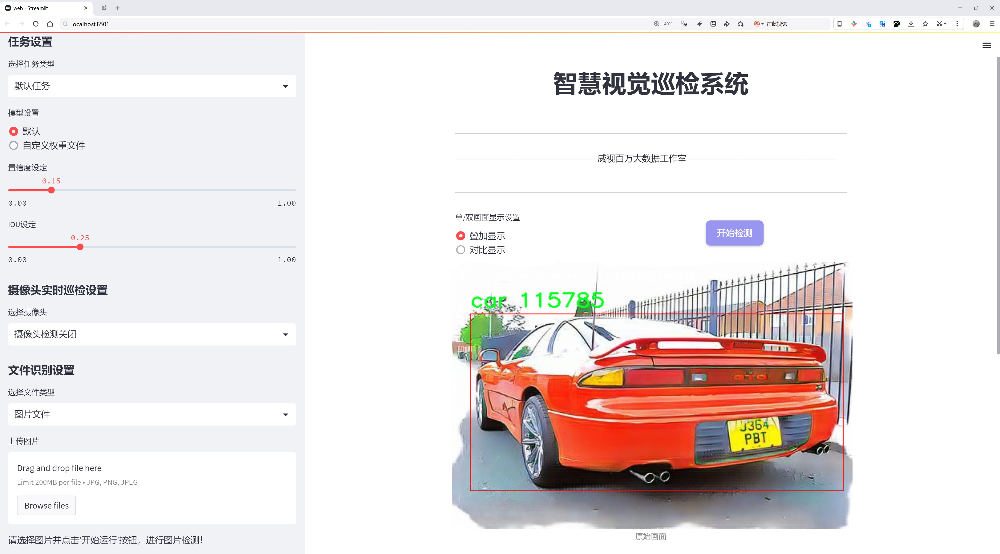
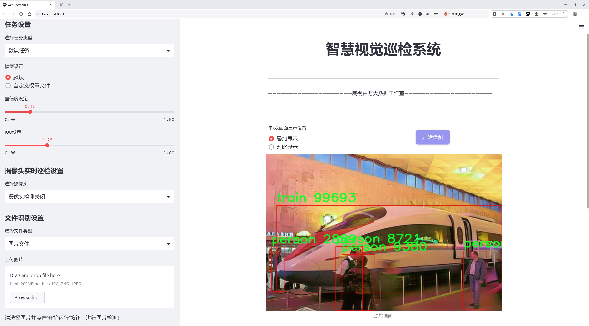
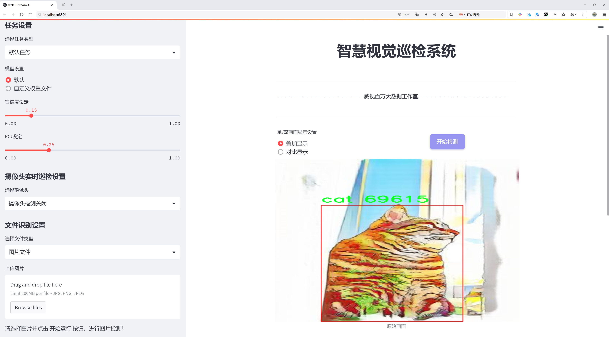
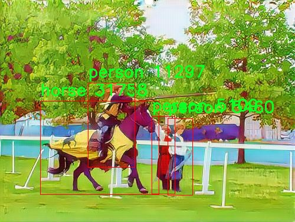
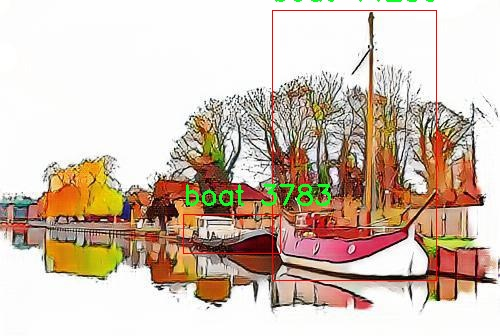
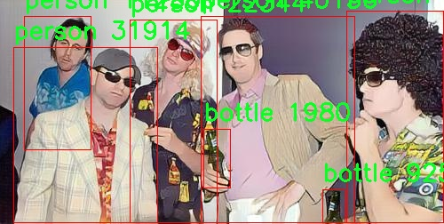
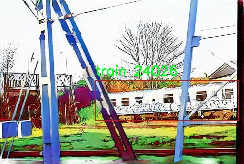
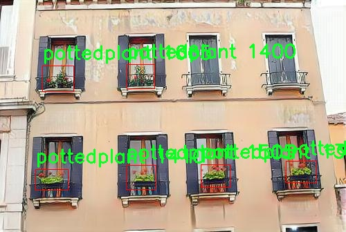

# 动漫场景交通检测检测系统源码分享
 # [一条龙教学YOLOV8标注好的数据集一键训练_70+全套改进创新点发刊_Web前端展示]

### 1.研究背景与意义

项目参考[AAAI Association for the Advancement of Artificial Intelligence](https://gitee.com/qunshansj/projects)

项目来源[AACV Association for the Advancement of Computer Vision](https://gitee.com/qunmasj/projects)

研究背景与意义

随着城市化进程的加快，交通问题日益突出，交通安全与效率成为现代社会亟待解决的重要课题。尤其是在动漫场景中，交通元素的多样性和复杂性为交通检测系统的研发带来了新的挑战。传统的交通检测方法多依赖于人工标注和简单的图像处理技术，难以适应快速变化的交通环境和多样化的交通参与者。因此，基于深度学习的目标检测技术，尤其是YOLO（You Only Look Once）系列模型的应用，成为了解决这一问题的有效途径。

YOLOv8作为YOLO系列的最新版本，具备了更高的检测精度和更快的处理速度，适合在实时交通监控系统中应用。然而，针对动漫场景的交通检测，现有的YOLOv8模型在特定场景下的适应性和准确性仍有待提升。动漫场景的独特视觉风格和表现形式使得传统的目标检测算法在识别交通参与者和交通设施时面临诸多困难。因此，改进YOLOv8模型，以适应动漫场景的交通检测需求，具有重要的研究价值和实际意义。

本研究将基于CPR模块提供的5000张图像数据集，涵盖20个类别的交通参与者与物体，包括汽车、公交车、摩托车、行人等，构建一个针对动漫场景的交通检测系统。该数据集的多样性和丰富性为模型的训练提供了良好的基础，能够有效提升模型的泛化能力和检测精度。通过对YOLOv8模型的改进，我们将探索如何在动漫场景中优化特征提取和目标定位，以提高检测的准确性和实时性。

此外，动漫场景的交通检测不仅具有学术研究的意义，更在实际应用中展现出广泛的前景。随着动漫产业的蓬勃发展，动漫作品中的交通场景越来越多，如何在这些作品中实现智能化的交通监控和分析，将为交通管理、智能出行等领域提供新的思路和解决方案。通过构建基于改进YOLOv8的动漫场景交通检测系统，我们可以为交通安全和城市管理提供有力的技术支持，推动智能交通系统的发展。

综上所述，本研究不仅旨在提升YOLOv8在动漫场景中的检测能力，更希望通过系统的构建与验证，为未来的交通检测技术提供新的参考和借鉴。通过对动漫场景交通检测的深入研究，我们将为相关领域的研究者和从业者提供有价值的见解，推动交通检测技术的不断进步与创新。

### 2.图片演示







##### 注意：由于此博客编辑较早，上面“2.图片演示”和“3.视频演示”展示的系统图片或者视频可能为老版本，新版本在老版本的基础上升级如下：（实际效果以升级的新版本为准）

  （1）适配了YOLOV8的“目标检测”模型和“实例分割”模型，通过加载相应的权重（.pt）文件即可自适应加载模型。

  （2）支持“图片识别”、“视频识别”、“摄像头实时识别”三种识别模式。

  （3）支持“图片识别”、“视频识别”、“摄像头实时识别”三种识别结果保存导出，解决手动导出（容易卡顿出现爆内存）存在的问题，识别完自动保存结果并导出到tempDir中。

  （4）支持Web前端系统中的标题、背景图等自定义修改，后面提供修改教程。

  另外本项目提供训练的数据集和训练教程,暂不提供权重文件（best.pt）,需要您按照教程进行训练后实现图片演示和Web前端界面演示的效果。

### 3.视频演示

[3.1 视频演示](https://www.bilibili.com/video/BV1dv4ZeEE8P/)

### 4.数据集信息展示

##### 4.1 本项目数据集详细数据（类别数＆类别名）

nc: 20
names: ['aeroplane', 'bicycle', 'bird', 'boat', 'bottle', 'bus', 'car', 'cat', 'chair', 'cow', 'diningtable', 'dog', 'horse', 'motorbike', 'person', 'pottedplant', 'sheep', 'sofa', 'train', 'tvmonitor']


##### 4.2 本项目数据集信息介绍

数据集信息展示

在本研究中，我们使用了名为“CPR”的数据集，以改进YOLOv8在动漫场景中的交通检测系统。该数据集的设计旨在提供多样化的场景和对象，以便于训练和评估模型在复杂环境下的表现。CPR数据集包含20个类别，涵盖了交通工具、动物、家具及其他常见物品，这些类别的多样性使得模型能够更好地适应不同的视觉场景。

CPR数据集的类别包括：飞机（aeroplane）、自行车（bicycle）、鸟（bird）、船（boat）、瓶子（bottle）、公交车（bus）、汽车（car）、猫（cat）、椅子（chair）、牛（cow）、餐桌（diningtable）、狗（dog）、马（horse）、摩托车（motorbike）、人（person）、盆栽植物（pottedplant）、羊（sheep）、沙发（sofa）、火车（train）和电视机（tvmonitor）。这些类别不仅涵盖了交通工具，还包括了生活中常见的动物和家具，确保了数据集的广泛适用性。

在动漫场景中，交通检测面临着许多挑战，例如物体的遮挡、光照变化以及不同的视角。CPR数据集通过提供多样化的图像和场景，帮助模型学习到如何在这些复杂条件下进行准确的检测。每个类别的样本数量经过精心设计，以确保模型在训练过程中能够获得足够的样本量，从而提高其泛化能力。

数据集中的图像经过标注，确保每个对象的边界框和类别标签都准确无误。这些标注信息为YOLOv8模型的训练提供了必要的监督信号，使其能够在面对新的、未见过的图像时，依然能够做出准确的预测。此外，CPR数据集还考虑到了动漫风格的特征，例如色彩的鲜艳度、线条的清晰度以及形状的夸张，这些特征在传统的交通检测数据集中并不常见。因此，使用CPR数据集进行训练，能够使模型更好地适应动漫场景的特性。

在模型训练过程中，我们将数据集分为训练集、验证集和测试集，以便于对模型的性能进行全面评估。训练集用于模型的学习，验证集用于调整超参数，测试集则用于最终的性能评估。通过这种方式，我们能够确保模型在不同数据集上的表现稳定，具备良好的泛化能力。

总之，CPR数据集为改进YOLOv8的动漫场景交通检测系统提供了丰富的训练素材和多样化的场景设置。其包含的20个类别不仅涵盖了交通工具，还涉及了动物和家具等多个方面，使得模型能够在复杂的动漫环境中进行有效的检测。通过对该数据集的深入研究和应用，我们期望能够显著提升YOLOv8在动漫场景中的交通检测性能，为相关领域的研究和应用提供有力支持。











### 5.全套项目环境部署视频教程（零基础手把手教学）

[5.1 环境部署教程链接（零基础手把手教学）](https://www.ixigua.com/7404473917358506534?logTag=c807d0cbc21c0ef59de5)


[5.2 安装Python虚拟环境创建和依赖库安装视频教程链接（零基础手把手教学）](https://www.ixigua.com/7404474678003106304?logTag=1f1041108cd1f708b01a)

### 6.手把手YOLOV8训练视频教程（零基础小白有手就能学会）

[6.1 手把手YOLOV8训练视频教程（零基础小白有手就能学会）](https://www.ixigua.com/7404477157818401292?logTag=d31a2dfd1983c9668658)

### 7.70+种全套YOLOV8创新点代码加载调参视频教程（一键加载写好的改进模型的配置文件）

[7.1 70+种全套YOLOV8创新点代码加载调参视频教程（一键加载写好的改进模型的配置文件）](https://www.ixigua.com/7404478314661806627?logTag=29066f8288e3f4eea3a4)

### 8.70+种全套YOLOV8创新点原理讲解（非科班也可以轻松写刊发刊，V10版本正在科研待更新）

由于篇幅限制，每个创新点的具体原理讲解就不一一展开，具体见下列网址中的创新点对应子项目的技术原理博客网址【Blog】：


[8.1 70+种全套YOLOV8创新点原理讲解链接](https://gitee.com/qunmasj/good)

### 9.系统功能展示（检测对象为举例，实际内容以本项目数据集为准）

图9.1.系统支持检测结果表格显示

  图9.2.系统支持置信度和IOU阈值手动调节

  图9.3.系统支持自定义加载权重文件best.pt(需要你通过步骤5中训练获得)

  图9.4.系统支持摄像头实时识别

  图9.5.系统支持图片识别

  图9.6.系统支持视频识别

  图9.7.系统支持识别结果文件自动保存

  图9.8.系统支持Excel导出检测结果数据


### 10.原始YOLOV8算法原理

原始YOLOv8算法原理

YOLOv8算法是由Ultralytics公司于2023年1月10日发布的最新版本，标志着YOLO系列目标检测算法的又一次重大进步。该算法在YOLOv7的基础上进行了深度优化，采用了更为复杂的卷积神经网络结构，旨在提升目标检测的精度和速度。YOLOv8的设计理念是将整个图像作为输入，直接在图像上进行目标检测和定位，避免了传统方法中滑动窗口或区域提议的复杂性，从而显著提高了检测效率。

在数据预处理方面，YOLOv8继承了YOLOv5的策略，采用了多种增强手段，包括马赛克增强、混合增强、空间扰动和颜色扰动等。这些增强技术不仅提高了模型的鲁棒性，还有效地扩展了训练数据集的多样性，使得模型能够更好地适应不同场景下的目标检测任务。

YOLOv8的骨干网络结构在YOLOv5的基础上进行了改进，采用了新的C2f模块来替代原有的C3模块。C2f模块的设计理念是通过引入更多的分支来丰富梯度回传时的支流，从而提高特征提取的效率和准确性。每一层步长为2的3×3卷积用于降采样特征图，接着通过C2f模块进一步强化特征，确保网络在不同尺度上都能有效地捕捉到目标信息。

在特征金字塔网络（FPN）和路径聚合网络（PAN）的结合使用上，YOLOv8继续沿用YOLOv5的设计思路，以实现多尺度信息的充分融合。FPN-PAN结构的核心在于能够有效地整合来自不同层次的特征图，从而增强模型对小目标和大目标的检测能力。C2f模块的引入，使得特征的传递更加灵活，进而提升了整体的检测性能。

YOLOv8在检测头的设计上也进行了创新，采用了解耦头结构。这一结构将分类和定位任务分开处理，分别通过两条并行的分支提取类别特征和位置特征，最终通过1×1卷积完成分类和定位的任务。这种解耦的设计使得模型在处理复杂场景时，能够更清晰地识别目标的类别和位置，进而提高检测的准确性。

在标签分配策略方面，YOLOv8摒弃了依赖于数据集的候选框聚类方法，转而采用了一种动态标签分配策略，称为TOOD策略。这一策略通过对目标框和目标分数的动态调整，优化了正负样本的匹配过程。YOLOv8的损失函数主要由类别损失和位置损失两部分组成，其中类别损失采用了Varifocal Loss（VFL），而位置损失则结合了CIoULoss与DFLLoss。VFL的设计旨在通过不对称参数对正负样本进行加权，使得模型在训练过程中更加关注高质量的正样本，从而提升整体的检测性能。

值得一提的是，YOLOv8在性能上也取得了显著的提升。与前一版本相比，YOLOv8在精度（mAP）和帧率上均有显著提高，分别提升了43.23%和10.28倍。这使得YOLOv8在智能监控、自动驾驶和人脸识别等应用场景中，展现出了更为优越的性能，成为目标检测领域的一个重要工具。

总的来说，YOLOv8算法通过对网络结构的深度优化、数据预处理的增强、标签分配策略的改进等多方面的创新，成功地提升了目标检测的精度和速度。其在处理复杂场景时的高效性和准确性，使得YOLOv8成为了现代计算机视觉领域中不可或缺的一部分，为各种实际应用提供了强有力的支持。随着YOLOv8的广泛应用，未来在目标检测领域的研究和实践中，必将推动更多创新的出现。


### 11.项目核心源码讲解（再也不用担心看不懂代码逻辑）

#### 11.1 code\ultralytics\assets\utils\__init__.py

以下是代码的核心部分，并附上详细的中文注释：

```python
from sys import version_info as py_version  # 导入Python版本信息

def __pyarmor__():  # 定义一个函数，用于导入pyarmor运行时
    import platform  # 导入平台模块
    import sys  # 导入系统模块
    from struct import calcsize  # 从struct模块导入calcsize函数，用于计算数据类型的大小

    def format_system():  # 定义一个函数，用于格式化系统信息
        plat = platform.system().lower()  # 获取操作系统名称并转换为小写
        # 根据操作系统名称进行分类
        plat = ('windows' if plat.startswith('cygwin') else
                'linux' if plat.startswith('linux') else
                'freebsd' if plat.startswith(
                    ('freebsd', 'openbsd', 'isilon onefs')) else plat)
        if plat == 'linux':  # 如果是Linux系统
            if hasattr(sys, 'getandroidapilevel'):  # 检查是否为Android
                plat = 'android'
            else:
                cname, cver = platform.libc_ver()  # 获取C标准库的名称和版本
                if cname == 'musl':  # 如果是musl库
                    plat = 'alpine'  # 设置平台为alpine
                elif cname == 'libc':  # 如果是glibc
                    plat = 'android'  # 设置平台为android
        return plat  # 返回平台名称

    def format_machine():  # 定义一个函数，用于格式化机器架构信息
        mach = platform.machine().lower()  # 获取机器架构名称并转换为小写
        # 定义一个架构映射表
        arch_table = (
            ('x86', ('i386', 'i486', 'i586', 'i686')),
            ('x86_64', ('x64', 'x86_64', 'amd64', 'intel')),
            ('arm', ('armv5',)),
            ('armv6', ('armv6l',)),
            ('armv7', ('armv7l',)),
            ('aarch32', ('aarch32',)),
            ('aarch64', ('aarch64', 'arm64'))
        )
        # 遍历架构映射表，匹配机器架构
        for alias, archlist in arch_table:
            if mach in archlist:
                mach = alias  # 如果匹配成功，设置机器架构为别名
                break
        return mach  # 返回机器架构名称

    plat, mach = format_system(), format_machine()  # 获取平台和机器架构信息
    # 如果是Windows系统且机器架构为x86_64
    if plat == 'windows' and mach == 'x86_64':
        bitness = calcsize('P'.encode()) * 8  # 计算指针的位数
        if bitness == 32:  # 如果是32位
            mach = 'x86'  # 设置机器架构为x86
    # 生成pyarmor运行时模块的名称
    name = '.'.join(['py%d%d' % py_version[:2], '_'.join([plat, mach]), 'pyarmor_runtime'])
    return __import__(name, globals(), locals(), ['__pyarmor__'], level=1)  # 动态导入pyarmor运行时模块

__pyarmor__ = __pyarmor__().__pyarmor__  # 调用__pyarmor__函数并将返回值赋给__pyarmor__
```

### 代码分析：
1. **导入模块**：代码开始时导入了必要的模块，包括`platform`和`sys`，用于获取系统和平台信息。
2. **系统和机器架构的格式化**：定义了两个函数`format_system`和`format_machine`，分别用于获取和格式化操作系统及机器架构的信息。
3. **平台判断**：根据不同的条件判断系统类型（如Windows、Linux、Android等）和机器架构（如x86、x86_64、ARM等）。
4. **动态导入**：根据获取到的系统和架构信息，构建出pyarmor运行时模块的名称，并动态导入该模块。
5. **返回值**：最终将导入的模块赋值给`__pyarmor__`，以便后续使用。

这个代码的核心功能是根据当前运行环境动态加载pyarmor的运行时模块，以便进行后续的加密或保护操作。

这个文件是一个Python模块的初始化文件，主要用于动态导入一个与当前Python环境和操作系统相关的模块。以下是对代码的逐行分析和说明。

首先，代码导入了`sys`模块中的`version_info`，这个信息用于获取当前Python的版本信息。接着定义了一个名为`__pyarmor__`的函数，该函数内部又定义了两个辅助函数：`format_system`和`format_machine`。

`format_system`函数用于获取当前操作系统的类型。它通过`platform.system()`获取操作系统名称，并将其转换为小写。接着根据操作系统的不同前缀，将其标准化为'windows'、'linux'、'freebsd'等。对于Linux系统，函数还检查是否是Android系统，并根据C标准库的类型进一步细分为'alpine'或'android'。

`format_machine`函数则用于获取当前机器的架构类型。它同样通过`platform.machine()`获取机器类型，并将其转换为小写。然后，它定义了一个架构映射表，将不同的机器类型映射到更通用的名称（如'x86'、'x86_64'、'arm'等）。函数会遍历这个映射表，如果找到匹配的机器类型，就将其替换为通用名称。

接下来，代码调用`format_system`和`format_machine`函数，分别获取当前的操作系统和机器架构。特别地，如果操作系统是Windows且机器架构是x86_64，代码会进一步检查指针大小，以确定是32位还是64位系统，并相应地调整机器架构的名称。

最后，代码构建了一个模块名称，这个名称由Python版本、操作系统和机器架构组成，并附加上`pyarmor_runtime`。这个模块名称的构建使得可以根据不同的环境动态导入不同的模块。最后，通过`__import__`函数导入构建的模块，并返回该模块中的`__pyarmor__`对象。

总的来说，这个文件的主要功能是根据当前的Python版本、操作系统和机器架构动态导入一个特定的模块，以支持不同环境下的功能需求。这样的设计使得代码具有更好的可移植性和灵活性。

#### 11.2 ui.py

```python
import sys
import subprocess

def run_script(script_path):
    """
    使用当前 Python 环境运行指定的脚本。

    Args:
        script_path (str): 要运行的脚本路径

    Returns:
        None
    """
    # 获取当前 Python 解释器的路径
    python_path = sys.executable

    # 构建运行命令
    command = f'"{python_path}" -m streamlit run "{script_path}"'

    # 执行命令
    result = subprocess.run(command, shell=True)
    if result.returncode != 0:
        print("脚本运行出错。")


# 实例化并运行应用
if __name__ == "__main__":
    # 指定您的脚本路径
    script_path = "web.py"  # 这里可以直接指定脚本路径

    # 运行脚本
    run_script(script_path)
```

### 代码注释说明：

1. **导入模块**：
   - `import sys`：导入系统相关的模块，用于获取当前 Python 解释器的路径。
   - `import subprocess`：导入子进程模块，用于在 Python 中执行外部命令。

2. **定义函数 `run_script`**：
   - 函数接受一个参数 `script_path`，表示要运行的 Python 脚本的路径。
   - 使用 `sys.executable` 获取当前 Python 解释器的路径，以便在正确的环境中运行脚本。
   - 构建一个命令字符串 `command`，该命令使用 `streamlit` 模块运行指定的脚本。
   - 使用 `subprocess.run` 执行构建的命令，并通过 `shell=True` 允许在 shell 中执行。
   - 检查命令的返回码，如果不为 0，表示脚本运行出错，打印错误信息。

3. **主程序块**：
   - 使用 `if __name__ == "__main__":` 确保只有在直接运行该脚本时才会执行以下代码。
   - 指定要运行的脚本路径 `script_path`，在这里可以直接指定为 `"web.py"`。
   - 调用 `run_script` 函数，传入脚本路径以运行该脚本。

这个程序文件名为 `ui.py`，主要功能是使用当前的 Python 环境来运行一个指定的脚本，具体是一个名为 `web.py` 的 Streamlit 应用。

程序首先导入了必要的模块，包括 `sys`、`os` 和 `subprocess`，其中 `sys` 模块用于访问与 Python 解释器相关的变量和函数，`os` 模块提供了与操作系统交互的功能，而 `subprocess` 模块则用于执行外部命令。

接着，程序从 `QtFusion.path` 模块中导入了 `abs_path` 函数，这个函数的作用是获取给定路径的绝对路径。

在 `run_script` 函数中，首先定义了一个参数 `script_path`，它是要运行的脚本的路径。函数内部通过 `sys.executable` 获取当前 Python 解释器的路径，并将其与要运行的脚本路径结合，构建出一个命令字符串。这个命令使用了 Streamlit 的运行方式，即通过 `-m streamlit run` 来执行指定的脚本。

随后，使用 `subprocess.run` 方法执行构建好的命令。如果命令执行后返回的状态码不为零，表示脚本运行出错，程序会输出相应的错误信息。

在文件的最后部分，使用 `if __name__ == "__main__":` 来判断当前模块是否是主程序。如果是，则指定要运行的脚本路径为 `web.py` 的绝对路径，并调用 `run_script` 函数来执行这个脚本。

总体来看，这个程序的核心功能是封装了一个运行 Streamlit 应用的过程，方便用户通过 `ui.py` 来启动 `web.py` 脚本。

#### 11.3 70+种YOLOv8算法改进源码大全和调试加载训练教程（非必要）\ultralytics\hub\session.py

以下是代码中最核心的部分，并附上详细的中文注释：

```python
import signal
import sys
from pathlib import Path
from time import sleep
import requests
from ultralytics.hub.utils import HUB_API_ROOT, HUB_WEB_ROOT, smart_request
from ultralytics.utils import LOGGER, __version__, checks, is_colab
from ultralytics.utils.errors import HUBModelError

AGENT_NAME = f'python-{__version__}-colab' if is_colab() else f'python-{__version__}-local'

class HUBTrainingSession:
    """
    HUB训练会话，用于Ultralytics HUB YOLO模型。处理模型初始化、心跳和检查点上传。
    """

    def __init__(self, url):
        """
        初始化HUBTrainingSession，使用提供的模型标识符。

        参数:
            url (str): 用于初始化HUB训练会话的模型标识符，可以是URL字符串或特定格式的模型键。

        异常:
            ValueError: 如果提供的模型标识符无效。
            ConnectionError: 如果连接全局API密钥不被支持。
        """
        from ultralytics.hub.auth import Auth

        # 解析输入的URL
        if url.startswith(f'{HUB_WEB_ROOT}/models/'):
            url = url.split(f'{HUB_WEB_ROOT}/models/')[-1]
        if [len(x) for x in url.split('_')] == [42, 20]:
            key, model_id = url.split('_')
        elif len(url) == 20:
            key, model_id = '', url
        else:
            raise HUBModelError(f"model='{url}' not found. Check format is correct.")

        # 授权
        auth = Auth(key)
        self.agent_id = None  # 识别与服务器通信的实例
        self.model_id = model_id
        self.model_url = f'{HUB_WEB_ROOT}/models/{model_id}'
        self.api_url = f'{HUB_API_ROOT}/v1/models/{model_id}'
        self.auth_header = auth.get_auth_header()
        self.rate_limits = {'metrics': 3.0, 'ckpt': 900.0, 'heartbeat': 300.0}  # API调用的速率限制（秒）
        self.timers = {}  # 速率限制计时器（秒）
        self.metrics_queue = {}  # 模型的指标队列
        self.model = self._get_model()  # 获取模型数据
        self.alive = True  # 心跳循环是否处于活动状态
        self._start_heartbeat()  # 启动心跳
        self._register_signal_handlers()  # 注册信号处理器
        LOGGER.info(f'查看模型在 {self.model_url} 🚀')

    def _register_signal_handlers(self):
        """注册信号处理器以优雅地处理终止信号。"""
        signal.signal(signal.SIGTERM, self._handle_signal)
        signal.signal(signal.SIGINT, self._handle_signal)

    def _handle_signal(self, signum, frame):
        """
        处理终止信号，防止在Colab上终止后发送心跳。

        该方法不使用frame参数，它是因为信号传递而包含的。
        """
        if self.alive:
            LOGGER.info('收到终止信号! ❌')
            self._stop_heartbeat()  # 停止心跳
            sys.exit(signum)  # 退出程序

    def _stop_heartbeat(self):
        """终止心跳循环。"""
        self.alive = False

    def upload_metrics(self):
        """将模型指标上传到Ultralytics HUB。"""
        payload = {'metrics': self.metrics_queue.copy(), 'type': 'metrics'}
        smart_request('post', self.api_url, json=payload, headers=self.auth_header)

    def _get_model(self):
        """从Ultralytics HUB获取并返回模型数据。"""
        api_url = f'{HUB_API_ROOT}/v1/models/{self.model_id}'

        try:
            response = smart_request('get', api_url, headers=self.auth_header)
            data = response.json().get('data', None)

            if data.get('status') == 'trained':
                raise ValueError('模型已训练并上传。')

            if not data.get('data'):
                raise ValueError('数据集可能仍在处理。请稍等并重试。')
            self.model_id = data['id']

            if data['status'] == 'new':  # 新模型开始训练
                self.train_args = {
                    'batch': data['batch_size'],
                    'epochs': data['epochs'],
                    'imgsz': data['imgsz'],
                    'patience': data['patience'],
                    'device': data['device'],
                    'cache': data['cache'],
                    'data': data['data']}
                self.model_file = data.get('cfg') or data.get('weights')
                self.model_file = checks.check_yolov5u_filename(self.model_file, verbose=False)
            elif data['status'] == 'training':  # 继续训练现有模型
                self.train_args = {'data': data['data'], 'resume': True}
                self.model_file = data['resume']

            return data
        except requests.exceptions.ConnectionError as e:
            raise ConnectionRefusedError('错误: HUB服务器未在线。请稍后再试。') from e

    @threaded
    def _start_heartbeat(self):
        """开始一个线程心跳循环，向Ultralytics HUB报告代理的状态。"""
        while self.alive:
            r = smart_request('post',
                              f'{HUB_API_ROOT}/v1/agent/heartbeat/models/{self.model_id}',
                              json={'agent': AGENT_NAME, 'agentId': self.agent_id},
                              headers=self.auth_header)
            self.agent_id = r.json().get('data', {}).get('agentId', None)
            sleep(self.rate_limits['heartbeat'])  # 根据速率限制进行休眠
```

### 代码说明：
1. **HUBTrainingSession类**：该类用于管理与Ultralytics HUB的训练会话，包括模型的初始化、心跳监测和指标上传等功能。
2. **初始化方法**：在初始化时，解析模型的URL，进行授权，设置相关的参数和状态。
3. **信号处理**：注册了信号处理器，以便在接收到终止信号时优雅地停止心跳。
4. **模型获取**：通过API请求获取模型的状态和相关数据，并根据状态设置训练参数。
5. **心跳机制**：通过一个线程定期向Ultralytics HUB发送心跳，报告代理的状态。

这个程序文件定义了一个名为 `HUBTrainingSession` 的类，主要用于管理 Ultralytics HUB 上 YOLO 模型的训练会话。该类的功能包括模型初始化、心跳信号发送和检查点上传等。

在类的初始化方法 `__init__` 中，首先会解析传入的模型标识符 `url`，该标识符可以是一个 URL 字符串或特定格式的模型键。解析后，如果格式不正确，则会抛出 `HUBModelError` 异常。接着，使用 `Auth` 类进行身份验证，并初始化与模型相关的各种属性，包括模型的 ID、URL、API URL、身份验证头、速率限制、计时器、模型数据等。然后，启动心跳机制以定期向服务器报告状态，并注册信号处理程序以优雅地处理终止信号。

类中有多个方法，其中 `_register_signal_handlers` 方法用于注册信号处理程序，以便在接收到终止信号时能够正确处理。`_handle_signal` 方法则是处理接收到的信号，停止心跳并退出程序。`upload_metrics` 方法用于将模型的性能指标上传到 Ultralytics HUB。`_get_model` 方法从 Ultralytics HUB 获取模型数据，并根据模型的状态设置训练参数。

此外，`upload_model` 方法用于将模型的检查点上传到 Ultralytics HUB，支持上传当前训练的权重文件以及标记当前模型是否为最佳模型。最后，`_start_heartbeat` 方法在一个线程中运行，定期向服务器发送心跳信号，报告代理的状态。

整个类的设计旨在简化与 Ultralytics HUB 的交互，使得用户能够方便地管理 YOLO 模型的训练过程，并及时上传训练数据和模型权重。

#### 11.4 70+种YOLOv8算法改进源码大全和调试加载训练教程（非必要）\ultralytics\models\rtdetr\__init__.py

以下是代码中最核心的部分，并附上详细的中文注释：

```python
# 导入RTDETR模型、预测器和验证器
from .model import RTDETR  # 导入RTDETR模型类
from .predict import RTDETRPredictor  # 导入RTDETR预测器类
from .val import RTDETRValidator  # 导入RTDETR验证器类

# 定义模块的公开接口，包含RTDETR模型、预测器和验证器
__all__ = 'RTDETRPredictor', 'RTDETRValidator', 'RTDETR'
```

### 注释说明：
1. **导入模块**：
   - `from .model import RTDETR`：从当前包的`model`模块中导入`RTDETR`类，`RTDETR`是一个用于目标检测的模型。
   - `from .predict import RTDETRPredictor`：从当前包的`predict`模块中导入`RTDETRPredictor`类，负责使用`RTDETR`模型进行预测。
   - `from .val import RTDETRValidator`：从当前包的`val`模块中导入`RTDETRValidator`类，负责对模型的性能进行验证。

2. **定义公开接口**：
   - `__all__`：这是一个特殊变量，用于定义模块的公共接口。只有在使用`from module import *`时，列出的名称才会被导入。这里列出了`RTDETRPredictor`、`RTDETRValidator`和`RTDETR`，表示这些是模块的主要功能部分。

这个程序文件是Ultralytics YOLO项目的一部分，主要用于实现RTDETR（Real-Time Detection Transformer）模型的相关功能。文件中首先声明了该项目使用AGPL-3.0许可证，这意味着用户可以自由使用、修改和分发代码，但需要遵循相应的许可证条款。

接下来，文件通过相对导入的方式引入了三个模块：RTDETR、RTDETRPredictor和RTDETRValidator。这些模块分别负责模型的定义、预测功能和验证功能。具体来说，RTDETR模块包含了模型的核心结构和算法实现，RTDETRPredictor模块用于进行实时预测，RTDETRValidator模块则用于验证模型的性能和准确性。

最后，`__all__`变量被定义为一个包含字符串的元组，列出了该模块对外公开的接口。这意味着当使用`from module import *`语句时，只会导入这些指定的对象，帮助用户更好地理解和使用该模块，同时也避免了不必要的命名冲突。

总的来说，这个文件是RTDETR模型实现的基础部分，负责模块的组织和接口的定义，为后续的模型训练和推理提供了必要的支持。

#### 11.5 70+种YOLOv8算法改进源码大全和调试加载训练教程（非必要）\ultralytics\utils\tal.py

以下是代码中最核心的部分，并附上详细的中文注释：

```python
import torch
import torch.nn as nn

def select_candidates_in_gts(xy_centers, gt_bboxes, eps=1e-9):
    """
    选择在真实框(gt)中的正锚点中心。

    参数:
        xy_centers (Tensor): 形状为(h*w, 2)的张量，表示锚点的中心坐标。
        gt_bboxes (Tensor): 形状为(b, n_boxes, 4)的张量，表示真实框的坐标。

    返回:
        (Tensor): 形状为(b, n_boxes, h*w)的张量，表示每个真实框内的锚点中心。
    """
    n_anchors = xy_centers.shape[0]  # 锚点数量
    bs, n_boxes, _ = gt_bboxes.shape  # 批量大小和真实框数量
    lt, rb = gt_bboxes.view(-1, 1, 4).chunk(2, 2)  # 分割真实框为左上角和右下角
    bbox_deltas = torch.cat((xy_centers[None] - lt, rb - xy_centers[None]), dim=2).view(bs, n_boxes, n_anchors, -1)
    return bbox_deltas.amin(3).gt_(eps)  # 返回每个锚点是否在真实框内的布尔值

class TaskAlignedAssigner(nn.Module):
    """
    用于目标检测的任务对齐分配器。

    此类根据任务对齐指标将真实对象分配给锚点，该指标结合了分类和定位信息。

    属性:
        topk (int): 考虑的候选框数量。
        num_classes (int): 目标类别数量。
        alpha (float): 分类组件的alpha参数。
        beta (float): 定位组件的beta参数。
        eps (float): 防止除以零的小值。
    """

    def __init__(self, topk=13, num_classes=80, alpha=1.0, beta=6.0, eps=1e-9):
        """初始化任务对齐分配器对象，设置可调超参数。"""
        super().__init__()
        self.topk = topk
        self.num_classes = num_classes
        self.bg_idx = num_classes  # 背景类别索引
        self.alpha = alpha
        self.beta = beta
        self.eps = eps

    @torch.no_grad()
    def forward(self, pd_scores, pd_bboxes, anc_points, gt_labels, gt_bboxes, mask_gt):
        """
        计算任务对齐分配。

        参数:
            pd_scores (Tensor): 形状为(bs, num_total_anchors, num_classes)的张量，表示预测的得分。
            pd_bboxes (Tensor): 形状为(bs, num_total_anchors, 4)的张量，表示预测的边界框。
            anc_points (Tensor): 形状为(num_total_anchors, 2)的张量，表示锚点的坐标。
            gt_labels (Tensor): 形状为(bs, n_max_boxes, 1)的张量，表示真实框的标签。
            gt_bboxes (Tensor): 形状为(bs, n_max_boxes, 4)的张量，表示真实框的坐标。
            mask_gt (Tensor): 形状为(bs, n_max_boxes, 1)的张量，表示真实框的掩码。

        返回:
            target_labels (Tensor): 形状为(bs, num_total_anchors)的张量，包含目标锚点的标签。
            target_bboxes (Tensor): 形状为(bs, num_total_anchors, 4)的张量，包含目标锚点的边界框。
            target_scores (Tensor): 形状为(bs, num_total_anchors, num_classes)的张量，包含目标锚点的得分。
            fg_mask (Tensor): 形状为(bs, num_total_anchors)的布尔张量，表示正锚点。
            target_gt_idx (Tensor): 形状为(bs, num_total_anchors)的张量，表示目标真实框的索引。
        """
        self.bs = pd_scores.size(0)  # 批量大小
        self.n_max_boxes = gt_bboxes.size(1)  # 最大真实框数量

        if self.n_max_boxes == 0:  # 如果没有真实框
            device = gt_bboxes.device
            return (torch.full_like(pd_scores[..., 0], self.bg_idx).to(device), 
                    torch.zeros_like(pd_bboxes).to(device),
                    torch.zeros_like(pd_scores).to(device), 
                    torch.zeros_like(pd_scores[..., 0]).to(device),
                    torch.zeros_like(pd_scores[..., 0]).to(device))

        mask_pos, align_metric, overlaps = self.get_pos_mask(pd_scores, pd_bboxes, gt_labels, gt_bboxes, anc_points, mask_gt)

        target_gt_idx, fg_mask, mask_pos = select_highest_overlaps(mask_pos, overlaps, self.n_max_boxes)

        # 获取目标标签、边界框和得分
        target_labels, target_bboxes, target_scores = self.get_targets(gt_labels, gt_bboxes, target_gt_idx, fg_mask)

        # 归一化
        align_metric *= mask_pos
        pos_align_metrics = align_metric.amax(dim=-1, keepdim=True)  # 计算正样本的对齐指标
        pos_overlaps = (overlaps * mask_pos).amax(dim=-1, keepdim=True)  # 计算正样本的重叠度
        norm_align_metric = (align_metric * pos_overlaps / (pos_align_metrics + self.eps)).amax(-2).unsqueeze(-1)
        target_scores = target_scores * norm_align_metric  # 更新目标得分

        return target_labels, target_bboxes, target_scores, fg_mask.bool(), target_gt_idx

    def get_pos_mask(self, pd_scores, pd_bboxes, gt_labels, gt_bboxes, anc_points, mask_gt):
        """获取在真实框内的掩码，形状为(b, max_num_obj, h*w)。"""
        mask_in_gts = select_candidates_in_gts(anc_points, gt_bboxes)  # 获取在真实框内的锚点掩码
        align_metric, overlaps = self.get_box_metrics(pd_scores, pd_bboxes, gt_labels, gt_bboxes, mask_in_gts * mask_gt)  # 计算对齐指标和重叠度
        mask_topk = self.select_topk_candidates(align_metric, topk_mask=mask_gt.expand(-1, -1, self.topk).bool())  # 选择top-k候选
        mask_pos = mask_topk * mask_in_gts * mask_gt  # 合并掩码

        return mask_pos, align_metric, overlaps

    def get_box_metrics(self, pd_scores, pd_bboxes, gt_labels, gt_bboxes, mask_gt):
        """计算给定预测和真实边界框的对齐指标。"""
        na = pd_bboxes.shape[-2]  # 锚点数量
        mask_gt = mask_gt.bool()  # 转换为布尔类型
        overlaps = torch.zeros([self.bs, self.n_max_boxes, na], dtype=pd_bboxes.dtype, device=pd_bboxes.device)  # 初始化重叠度张量
        bbox_scores = torch.zeros([self.bs, self.n_max_boxes, na], dtype=pd_scores.dtype, device=pd_scores.device)  # 初始化边界框得分张量

        ind = torch.zeros([2, self.bs, self.n_max_boxes], dtype=torch.long)  # 初始化索引张量
        ind[0] = torch.arange(end=self.bs).view(-1, 1).expand(-1, self.n_max_boxes)  # 批量索引
        ind[1] = gt_labels.squeeze(-1)  # 真实框标签索引
        bbox_scores[mask_gt] = pd_scores[ind[0], :, ind[1]][mask_gt]  # 获取每个锚点的得分

        # 计算重叠度
        pd_boxes = pd_bboxes.unsqueeze(1).expand(-1, self.n_max_boxes, -1, -1)[mask_gt]  # 扩展预测边界框
        gt_boxes = gt_bboxes.unsqueeze(2).expand(-1, -1, na, -1)[mask_gt]  # 扩展真实边界框
        overlaps[mask_gt] = bbox_iou(gt_boxes, pd_boxes, xywh=False, CIoU=True).squeeze(-1).clamp_(0)  # 计算IoU

        align_metric = bbox_scores.pow(self.alpha) * overlaps.pow(self.beta)  # 计算对齐指标
        return align_metric, overlaps

    def get_targets(self, gt_labels, gt_bboxes, target_gt_idx, fg_mask):
        """
        计算正锚点的目标标签、目标边界框和目标得分。

        参数:
            gt_labels (Tensor): 真实框标签，形状为(b, max_num_obj, 1)。
            gt_bboxes (Tensor): 真实框边界框，形状为(b, max_num_obj, 4)。
            target_gt_idx (Tensor): 正锚点的真实框索引，形状为(b, h*w)。
            fg_mask (Tensor): 布尔张量，形状为(b, h*w)，表示正锚点。

        返回:
            (Tuple[Tensor, Tensor, Tensor]): 包含目标标签、目标边界框和目标得分的元组。
        """
        batch_ind = torch.arange(end=self.bs, dtype=torch.int64, device=gt_labels.device)[..., None]
        target_gt_idx = target_gt_idx + batch_ind * self.n_max_boxes  # 计算目标真实框索引
        target_labels = gt_labels.long().flatten()[target_gt_idx]  # 获取目标标签

        target_bboxes = gt_bboxes.view(-1, 4)[target_gt_idx]  # 获取目标边界框

        target_labels.clamp_(0)  # 限制标签值在有效范围内

        # 10倍于F.one_hot()的速度
        target_scores = torch.zeros((target_labels.shape[0], target_labels.shape[1], self.num_classes),
                                    dtype=torch.int64,
                                    device=target_labels.device)  # 初始化目标得分张量
        target_scores.scatter_(2, target_labels.unsqueeze(-1), 1)  # 根据目标标签填充得分

        fg_scores_mask = fg_mask[:, :, None].repeat(1, 1, self.num_classes)  # 扩展前景掩码
        target_scores = torch.where(fg_scores_mask > 0, target_scores, 0)  # 根据前景掩码更新得分

        return target_labels, target_bboxes, target_scores
```

以上代码主要实现了一个任务对齐分配器（`TaskAlignedAssigner`），用于在目标检测中将真实框分配给锚点。代码中包含了选择正锚点、计算对齐指标、选择top-k候选以及生成目标标签、边界框和得分的功能。

这个程序文件是Ultralytics YOLO（You Only Look Once）模型的一部分，主要用于目标检测任务中的锚框（anchor box）分配和处理。代码中定义了一些函数和一个类，主要用于计算和选择与真实目标（ground truth）框相对应的锚框。

首先，文件导入了必要的库，包括PyTorch和一些自定义的模块。接着，定义了一个函数`select_candidates_in_gts`，该函数用于选择与真实目标框（gt_bboxes）重叠的锚框中心（xy_centers）。它通过计算锚框中心与真实框的距离，返回一个布尔张量，指示哪些锚框是有效的。

接下来，`select_highest_overlaps`函数用于处理锚框与多个真实框之间的重叠情况。如果一个锚框被分配给多个真实框，它会选择与真实框重叠度最高的那个。这个函数返回目标框的索引、前景掩码和更新后的掩码。

然后，定义了一个名为`TaskAlignedAssigner`的类，这是一个用于目标检测的任务对齐分配器。该类的构造函数初始化了一些超参数，包括考虑的候选框数量、类别数量、分类和定位的权重等。在`forward`方法中，该类实现了任务对齐的分配逻辑，计算每个锚框的目标标签、目标框和目标分数。

在`get_pos_mask`方法中，计算有效锚框的掩码，结合了锚框与真实框的重叠情况和对齐度。在`get_box_metrics`方法中，计算预测框与真实框之间的对齐度和重叠度，返回这些指标以供后续使用。

`select_topk_candidates`方法用于选择前k个候选框，基于给定的指标进行排序。`get_targets`方法则计算正锚框的目标标签、目标框和目标分数。

此外，文件中还定义了一些辅助函数，如`make_anchors`用于生成锚框，`dist2bbox`和`bbox2dist`用于在锚框和真实框之间进行坐标转换。

总体来说，这个文件实现了YOLO模型中锚框的选择和分配逻辑，为目标检测任务提供了基础功能。通过合理的锚框分配，可以提高模型的检测精度和效率。

#### 11.6 train.py

以下是经过简化和注释的核心代码部分，主要集中在 YOLO 模型的训练过程中的数据集构建、数据加载、模型设置等功能。

```python
import random
import numpy as np
import torch.nn as nn
from ultralytics.data import build_dataloader, build_yolo_dataset
from ultralytics.engine.trainer import BaseTrainer
from ultralytics.models import yolo
from ultralytics.nn.tasks import DetectionModel
from ultralytics.utils import LOGGER, RANK
from ultralytics.utils.torch_utils import de_parallel, torch_distributed_zero_first

class DetectionTrainer(BaseTrainer):
    """
    扩展自 BaseTrainer 类，用于基于检测模型的训练。
    """

    def build_dataset(self, img_path, mode="train", batch=None):
        """
        构建 YOLO 数据集。

        参数:
            img_path (str): 包含图像的文件夹路径。
            mode (str): 模式，`train` 或 `val`，用户可以为每种模式自定义不同的增强。
            batch (int, optional): 批次大小，仅用于 `rect` 模式。默认为 None。
        """
        gs = max(int(de_parallel(self.model).stride.max() if self.model else 0), 32)  # 获取模型的最大步幅
        return build_yolo_dataset(self.args, img_path, batch, self.data, mode=mode, rect=mode == "val", stride=gs)

    def get_dataloader(self, dataset_path, batch_size=16, rank=0, mode="train"):
        """构造并返回数据加载器。"""
        assert mode in ["train", "val"]  # 确保模式有效
        with torch_distributed_zero_first(rank):  # 在分布式训练中，确保数据集只初始化一次
            dataset = self.build_dataset(dataset_path, mode, batch_size)  # 构建数据集
        shuffle = mode == "train"  # 训练模式下打乱数据
        workers = self.args.workers if mode == "train" else self.args.workers * 2  # 设置工作线程数
        return build_dataloader(dataset, batch_size, workers, shuffle, rank)  # 返回数据加载器

    def preprocess_batch(self, batch):
        """对图像批次进行预处理，包括缩放和转换为浮点数。"""
        batch["img"] = batch["img"].to(self.device, non_blocking=True).float() / 255  # 将图像转换为浮点数并归一化
        if self.args.multi_scale:  # 如果启用多尺度
            imgs = batch["img"]
            sz = (
                random.randrange(self.args.imgsz * 0.5, self.args.imgsz * 1.5 + self.stride)
                // self.stride
                * self.stride
            )  # 随机选择图像大小
            sf = sz / max(imgs.shape[2:])  # 计算缩放因子
            if sf != 1:  # 如果需要缩放
                ns = [
                    math.ceil(x * sf / self.stride) * self.stride for x in imgs.shape[2:]
                ]  # 计算新的形状
                imgs = nn.functional.interpolate(imgs, size=ns, mode="bilinear", align_corners=False)  # 进行插值缩放
            batch["img"] = imgs  # 更新批次图像
        return batch

    def set_model_attributes(self):
        """设置模型的属性，包括类别数量和名称。"""
        self.model.nc = self.data["nc"]  # 将类别数量附加到模型
        self.model.names = self.data["names"]  # 将类别名称附加到模型
        self.model.args = self.args  # 将超参数附加到模型

    def get_model(self, cfg=None, weights=None, verbose=True):
        """返回 YOLO 检测模型。"""
        model = DetectionModel(cfg, nc=self.data["nc"], verbose=verbose and RANK == -1)  # 创建检测模型
        if weights:
            model.load(weights)  # 加载权重
        return model

    def plot_training_samples(self, batch, ni):
        """绘制带有注释的训练样本。"""
        plot_images(
            images=batch["img"],
            batch_idx=batch["batch_idx"],
            cls=batch["cls"].squeeze(-1),
            bboxes=batch["bboxes"],
            paths=batch["im_file"],
            fname=self.save_dir / f"train_batch{ni}.jpg",
            on_plot=self.on_plot,
        )
```

### 代码说明：
1. **数据集构建**：`build_dataset` 方法负责根据输入的图像路径和模式（训练或验证）构建 YOLO 数据集。
2. **数据加载器**：`get_dataloader` 方法创建数据加载器，支持分布式训练并设置批次大小和工作线程数。
3. **批次预处理**：`preprocess_batch` 方法对输入的图像批次进行归一化和可选的多尺度处理。
4. **模型属性设置**：`set_model_attributes` 方法将数据集的类别信息附加到模型上。
5. **模型获取**：`get_model` 方法返回一个 YOLO 检测模型，并可选择加载预训练权重。
6. **训练样本绘制**：`plot_training_samples` 方法用于可视化训练样本及其注释。

这个程序文件 `train.py` 是一个用于训练 YOLO（You Only Look Once）目标检测模型的脚本，继承自 `BaseTrainer` 类。它主要负责构建数据集、数据加载器、模型设置、训练过程中的损失计算以及可视化等功能。

首先，程序导入了必要的库和模块，包括数学计算、随机数生成、深度学习框架 PyTorch 以及 Ultralytics 提供的各种工具和函数。接着，定义了 `DetectionTrainer` 类，该类专门用于处理基于检测模型的训练。

在 `DetectionTrainer` 类中，`build_dataset` 方法用于构建 YOLO 数据集。它接收图像路径、模式（训练或验证）和批次大小作为参数，利用 `build_yolo_dataset` 函数生成数据集，并根据模型的步幅设置合适的图像大小。

`get_dataloader` 方法则用于构建数据加载器。它根据传入的模式（训练或验证）调用 `build_dataset` 方法，并设置数据加载的参数，如是否打乱数据、工作线程数等。

`preprocess_batch` 方法负责对输入的图像批次进行预处理，包括将图像缩放到适当的大小并转换为浮点数格式。它还支持多尺度训练，通过随机选择图像大小来增强模型的鲁棒性。

`set_model_attributes` 方法用于设置模型的属性，包括类别数量和类别名称等，以确保模型能够正确处理特定的数据集。

`get_model` 方法返回一个 YOLO 检测模型实例，并可选择加载预训练权重。`get_validator` 方法则返回一个用于模型验证的 `DetectionValidator` 实例。

在训练过程中，`label_loss_items` 方法用于生成带有标签的损失字典，方便监控训练过程中的损失情况。`progress_string` 方法则返回一个格式化的字符串，显示训练进度，包括当前的轮次、GPU 内存使用情况、损失值、实例数量和图像大小等信息。

此外，`plot_training_samples` 方法用于绘制训练样本及其标注，`plot_metrics` 方法用于从 CSV 文件中绘制训练指标，而 `plot_training_labels` 方法则创建一个带标签的训练图，展示模型在训练集上的表现。

总体而言，这个文件实现了 YOLO 模型训练的核心功能，涵盖了数据处理、模型设置、训练监控和结果可视化等多个方面，为目标检测任务提供了一个完整的训练框架。

### 12.系统整体结构（节选）

### 整体功能和构架概括

该项目是一个基于YOLO（You Only Look Once）模型的目标检测框架，旨在提供一个完整的训练、验证和推理解决方案。项目的架构分为多个模块，每个模块负责特定的功能，包括模型定义、数据处理、训练过程管理、推理、可视化等。通过这些模块的协作，用户可以方便地进行目标检测模型的训练和评估，同时支持多种改进和扩展。

以下是各个文件的功能概述：

| 文件路径                                                                                                   | 功能描述                                                                                       |
|------------------------------------------------------------------------------------------------------------|-----------------------------------------------------------------------------------------------|
| `code\ultralytics\assets\utils\__init__.py`                                                              | 动态导入与当前Python环境和操作系统相关的模块，支持模块的可移植性和灵活性。                     |
| `ui.py`                                                                                                   | 封装了一个运行Streamlit应用的过程，方便用户通过该脚本启动`web.py`。                           |
| `70+种YOLOv8算法改进源码大全和调试加载训练教程（非必要）\ultralytics\hub\session.py`                     | 管理YOLO模型的训练会话，包括模型初始化、心跳信号发送和检查点上传等功能。                     |
| `70+种YOLOv8算法改进源码大全和调试加载训练教程（非必要）\ultralytics\models\rtdetr\__init__.py`        | 实现RTDETR模型的相关功能，组织模块和接口，支持模型的训练和推理。                             |
| `70+种YOLOv8算法改进源码大全和调试加载训练教程（非必要）\ultralytics\utils\tal.py`                     | 实现锚框的选择和分配逻辑，为目标检测任务提供基础功能，提升模型检测精度和效率。               |
| `train.py`                                                                                               | 负责YOLO模型的训练过程，包括数据集构建、数据加载、模型设置、损失计算和可视化等功能。         |
| `70+种YOLOv8算法改进源码大全和调试加载训练教程（非必要）\ultralytics\nn\extra_modules\head.py`        | 定义YOLO模型的头部结构，负责输出特征图并进行目标检测的最终预测。                             |
| `70+种YOLOv8算法改进源码大全和调试加载训练教程（非必要）\ultralytics\utils\triton.py`                 | 提供与Triton推理服务器的接口，支持模型的在线推理和服务。                                     |
| `code\ultralytics\utils\callbacks\wb.py`                                                                 | 实现与Weights & Biases（W&B）集成的回调功能，用于监控和记录训练过程中的指标。                |
| `code\ui_style.py`                                                                                       | 定义Streamlit应用的样式和布局，提供用户界面的美观性和可用性。                               |
| `70+种YOLOv8算法改进源码大全和调试加载训练教程（非必要）\ultralytics\engine\predictor.py`              | 实现目标检测模型的推理功能，负责加载模型并对输入图像进行预测。                             |
| `70+种YOLOv8算法改进源码大全和调试加载训练教程（非必要）\ultralytics\nn\extra_modules\ops_dcnv3\modules\dcnv3.py` | 实现深度可分离卷积（DCNv3）模块，增强模型的特征提取能力。                                     |
| `code\ultralytics\models\sam\modules\encoders.py`                                                       | 定义SAM（Segment Anything Model）模型的编码器部分，负责输入图像的特征提取。                   |

通过这些模块的协作，用户可以高效地进行目标检测任务，支持多种模型改进和训练策略，提升模型的性能和适用性。

注意：由于此博客编辑较早，上面“11.项目核心源码讲解（再也不用担心看不懂代码逻辑）”中部分代码可能会优化升级，仅供参考学习，完整“训练源码”、“Web前端界面”和“70+种创新点源码”以“13.完整训练+Web前端界面+70+种创新点源码、数据集获取”的内容为准。

### 13.完整训练+Web前端界面+70+种创新点源码、数据集获取


# [下载链接：https://mbd.pub/o/bread/ZpuUm59r](https://mbd.pub/o/bread/ZpuUm59r)